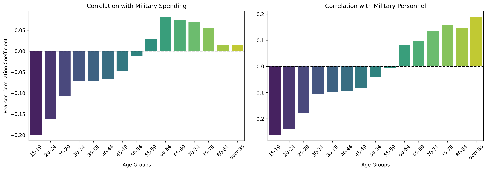

# Exploring the Link Between Violence Markers, Economic Shocks and Age-Specific Suicide Patterns
## Introduction

Although suicide, one of the leading causes of death globally, seems to be primarily linked with the mental state of an individual being disturbed by personal affairs, material conditions and the constant display of violence in the form of state control might play a bigger role. This study aims to explore the possible connections between age-based suicide rates and markers of violence, as well as the impact of global recessions on suicide rates. While mental health and its connection with suicide is well-studied, the role of state-sanctioned violence and conflicts is less understood. There is also a potential to reveal age-specific vulnerabilities.

Research Question: How do structural violence exposure (conflicts, military spending, military personnel rate, police presence) and economic shocks correlate with suicide rates across countries and age groups?

## Variables and Data Sources

| Variable                          | Data Type    | Based On             | Dataset                                                  | Link                                                                                          | Source  | Time Period     |
|----------------------------------|--------------|----------------------|-------------------------------------------------------|-----------------------------------------------------------------------------------------------|---------|-----------------|
| Suicide rates                    | Numeric      | Country-Year, Age Group | Reported suicide rates by age                        | [Link](https://ourworldindata.org/grapher/suicide-rates-by-age-who-mdb)                      | WHO     | 1950–2021       |
| Conflict status                  | Binary       | Country-Year         | States involved in state-based conflicts             | [Link](https://ourworldindata.org/grapher/states-involved-in-state-based-conflicts)          | UCDP    | 1946–2023       |
| Military spending per GDP        | Numeric      | Country-Year         | Military spending as a share of GDP                  | [Link](https://ourworldindata.org/grapher/military-spending-as-a-share-of-gdp-sipri)         | SIPRI   | 1948–2023       |
| Military personnel per population| Numeric      | Country-Year         | Military personnel as a share of total population    | [Link](https://ourworldindata.org/grapher/military-personnel-as-a-share-of-total-population) | COW     | 1816–2016       |
| Police officers per 1,000 people | Numeric      | Country-Year         | Police officers per 1,000 people                     | [Link](https://ourworldindata.org/grapher/police-officers-per-1000-people)                   | OWID    | 1973–2015       |
| Recession                        | Binary       | Year                 | {1975, 1982, 1991, 2009}                  | Hardcoded                                                                                             | IMF       | 1950-2020               |

## Methodology and Findings

### 1. Data Collection
Download the suicide rates by age, states involved in state-based conflicts, military spending as a share of gdp, military personnel as a share of total population, police officers per 1000 people datasets from Our World in Data. Recession years are hardcoded as there are only 4 global recessions (1975, 1982, 1991, 2009) since 1950 officially recognized by the IMF.

### 2. Data Cleanup
Merge the downloaded datasets, remove the rows with low-quality or missing data, remove countries with less than 30 entires and missing years in between their first and last entries. It should be noted that rows containing zeroes are eliminated first to filter out low-quality suicide data and police data should be merged in after any cleanup operations as it requires imputation due to missing data. Recession data is added last.

At this point, it can be observed that the data for police officers per 1,000 people has many gaps, especially in the early years. Consequently, only the time period from 2000 to 2016 is taken into consideration for analyses involving the use of this dataset. The missing values in this time period are imputed using forward and backward fill by country as the observed gaps are short. The scope of this operation, along with all analyses involving police data, is restricted to the focus countries (the United States, the United Kingdom, and Canada) to limit the number of required imputations.

### 3. Exploratory Data Analysis and Hypothesis Testing
#### I. Recession
Plotting the mean suicide rate in recession years and non-recession years versus age groups results in the subplot on the left-hand side, while the right-hand side shows the ratio of these two rates. 
 
It can be seen that although there is almost always an increase in suicide rates in recession years, this change is quite minimal to the point that it is nonexistent in the age group 55-59. A hypothesis test can be conducted to see whether the changes in suicide rates are statistically significant.

$H_0:$ The mean suicide rate in recession years is equal to the mean suicide rate in non-recession years for all age groups. $\mu_{\text{rec}} = \mu_{\text{non-rec}}$

$H_A:$ The mean suicide rate in recession years is different than the mean suicide rate in non-recession years for all age groups. $\mu_{\text{rec}} \neq \mu_{\text{non-rec}}$

Performing a two-sample t-test shows that the findings are statistically insignificant (each having a p value > .05); therefore, we fail to reject the null hypothesis. A snippet of these findings can be found below, while full results can be observed in the terminal output of `recession.py`. In the case that a recession has delayed effects on suicide data, the same analysis can be conducted with a 2-year lag on suicide data following each recession. The results do not change, however.  
| Age Group | Mean (Non-Recession) | Mean (Recession) | Ratio (Recession/Non-Recession) | T-statistic | p-value | Significant (p < 0.05) |
|-----------|----------------------|------------------|---------------------------------|-------------|---------|------------------------|
| 15-19     | 5.670014             | 6.009458         | 1.059867                        | 0.780788    | 0.437175 | False                  |
| 20-24     | 10.956867            | 11.953862        | 1.090993                        | 1.148659    | 0.254039 | False                  |
| 25-29     | 12.090031            | 13.389762        | 1.107504                        | 1.362063    | 0.177069 | False                  |

As shown below, there is not a marked increase in suicide rates in focus countries following global recessions.


#### II. Conflict
Most countries in the dataset have not been in any state-based conflicts in the year range, so conflict analysis conducted on all of the countries in the dataset leads to counterintuitive results such as below.

Instead, focus countries can be used for further conflict analysis. Canada, except for its earlier years, has no conflict history; while the two imperial countries, the US and the UK, have plenty.


A hypothesis test can be done to determine if the differences are significant enough.

$H_0:$ The mean suicide rate in conflict years is equal to the mean suicide rate in non-conflict years for both countries. $\mu_{\text{con}} = \mu_{\text{non-con}}$

$H_A:$ The mean suicide rate in conflict years is different than the mean suicide rate in non-conflict years for both countries. $\mu_{\text{con}} \neq \mu_{\text{non-con}}$

As seen in the table below, the difference in means is statistically significant for the UK, while it is statistically insignificant for the U.S. Though, we still fail to reject the null hypothesis, as the differences are not significant enough in at least one country under investigation. 
| Country           | Mean (Non-Conflict) | Mean (Conflict) | Ratio    | T-statistic | p-value        | Significant (p < 0.05) |
|-------------------|---------------------|-----------------|----------|-------------|----------------|------------------------|
| United Kingdom    | 133.171346          | 190.933660      | 1.433744 | 7.170544    | 4.846189e-10   | True                   |
| United States     | 251.018640          | 252.197484      | 1.004696 | 0.226009    | 4.109527e-01   | False                  |

#### III. Military Spending and Personnel
To avoid the use of a redundant variable, the Pearson correlation of these two variables is checked. A Pearson correlation score of  $0.688$ suggests that they are moderately correlated, though neither is redundant. As seen in the charts below, the two variables have almost no apparent correlation with age-based suicide rates.


Instead, focus countries could provide a possibly meaningful correlation. Below are two sets of scatterplots to visualize how the suicide rates of each age group correlates with military spending per GDP and military personnel per population in focus countries.
##### Military Spending

##### Military Personnel


It can be observed in the scatterplots that there seems to be a high positive correlation between military spending / personnel and suicide rates, especially in the 60-79 age range. However, the computed Spearman and Pearson correlation coefficients appear to be extremely low (some as low as $e^{-39}$) despite the majorly moderate correlation observed among the plots. Such extreme statistical results (infinitesimal p-values) suggest a potential data issue (possibly time-series autocorrelation where both variables follow similar long-term trends), which brings the independence of data points into question. Although it can be reasoned that rising military spending correlating with higher suicide rates could be linked to austerity measures, even such causations would unlikely lead to the observed extremities.

#### IV. Police Officers
The number of police officers per 1,000 population indicates, to an extent, the police presence among populations. For this dataset, due to the given reasons in section 2. Data Cleanup, only the focus countries from 2000 to 2016 are investigated. According to the plot below, there appears to be a negative correlation between suicide rates and police officers. 


Crisis intervention by the police could be playing a role in this. Though, in the design phase of this experiment, police data was chosen as a violence marker; as such, a hypothesis test can be done.

$H_0:$ There is no correlation between the number of police officers per 1000 people and suicide rates in the focus countries in 2000-2016. $\rho = 0$

$H_A:$ There is a positive correlation between the number of police officers per 1000 people and suicide rates in the focus countries in 2000-2016. $\rho \neq 0$

The results are found in the table below.
| Country         | Pearson r | p-value |
|----------------|-----------|---------|
| United States  | -0.659    | 0.004   |
| United Kingdom | -0.696    | 0.002   |
| Canada         | -0.403    | 0.109   |

There seems to be a negative trend in each country between the two variables, though only in the United States and the United Kingdom is the correlation significant (p-value < 0.05). Because statistical evidence is not significant enough in all focus countries in the specified time period, we fail to reject the null hypothesis.

### 4. Machine Learning
Machine learning can be used to go beyond linear correlation and explore more complex relationships between multiple variables. In this study, it is utilized to prioritize the factors under investigation (violence markers and economic indicators) in terms of their effect on suicide rates. In order to identify the most influential factors involved, Random Forest and XGBoost are preferred because of their ability to handle a mix of numerical (Military Spending, Military Personnel, Police Officers) and categorical (Conflict status, Recession years) data while inherently providing a measure of feature importance.

#### I. All Countries
Although XGBoost handles multicollinearity well enough, Random Forest works better with it eliminated, so Military Spending and Personnel data are combined into a single predictor. To maintain a wider scope (all countries and all years in the dataset), conflict and police data are ignored for the first part of the ML analysis. Plotting predictor variables (combined military features, recession years) against importance (how good of a predictor a variable is in comparison to other variables) results in the figure below.


The figure visually compares the feature importance of the two variables in predicting the total (of age groups) suicide rate using the two ML models across all countries and years. In both models, the military marker is the dominant, or the more important, predictor, suggesting that a joint measure of military spending and personnel per population is the primary factor among the markers for explaining variations in the total suicide rate by year. According to Random Forest, recession is not a good predictor of suicide rates at all compared to military markers, possibly indicating that its information is largely redundant. Conversely, the XGBoost model deems Recession more important. The higher importance, though still less than the military marker, suggests that Recession provides some unique information that helps XGBoost improve its predictions. This could indicate that the recessions have an effect on suicide rates not well captured by the military features, potentially signifying a nonlinear relationship or an interaction with a factor not accounted for in this research.

Below can be found a scatterplot of actual vs predicted suicide rates for the two models (both of which have an RMSE around 18), where it can be visually confirmed that the metrics are widely scattered and do not follow closely the ideal line. This shows that while the previous feature analysis highlighted the relative importance of each predictor, these variables are not strong enough predictors of the total suicide rate.


#### II. Focus Countries
To include all features discussed in this research, focus countries for the years 2000-2016 are analyzed with the same models. This time, the predictor variables are the combined military marker, conflict status, police officers per 100,000 people, and recession years. The figure below shows two feature importance plots (one for each model) side by side.


According to the figure, both models identify that the binary markers have significantly less importance in predicting the average suicide rate for the focus countries. While Random Forest still finds the military markers to be the most important predictor, XGBoost assigns notably higher relative importance to the police officers variable. Possibly due to Canada almost never and the UK constantly being in conflict, conflict data shows no importance in predicting the variance in suicide rates. As for recession, 2009 being the only data point in this year range explains its relative unimportance.

The predictive performance of the models on the test set for these focus countries was evaluated using RMSE (both with values around 0.85). These metrics are strong and are visually supported by the scatterplot below, where you can see that the points are tightly clustered around the ideal line. Although it seems as though these models, with the use of the identified features, are able to explain a substantial proportion of the variance in average suicide rates in the focus countries, the fact that the data is limited to $17 * 3 = 51$ entries could also provide an alternate, albeit negative, interpretation of such small errors and tight clusters.


## Conclusion
While this research examined potential associations between suicide rates and economic shocks (global recessions) or violence markers (conflict status, military spending, military personnel per population, police officers per 1,000 people), no statistically significant correlations were found in the studied countries. No clear evidence suggests that suicide rates systematically vary with recessions, with or without lag, in this dataset. Neither military spending, personnel ratios, nor police density showed a meaningful relationship with suicide trends. One point to note is that an absence of correlation here does not imply these factors are irrelevant to suicide prevention; rather, their relationship may be indirect, context-dependent, or observable only under different analytical conditions.

The analysis was restricted to a handful of, mostly developed, countries, as suicide data is either scarce or low-quality in developing nations. Broader geographic, but especially historical data, might yield different insights. Unmeasured variables such as mental health policies, income inequality or wealth accumulation could influence suicide rates independently. Subsequent studies could benefit from a holistic analysis into a developed country in depth, incorporating many other variables such as domestic conflicts. 

## Replicate this Study
1. Clone this repository.
2. Extract the contents if archived.
3. `cd` into the base directory (which contains this very readme.md).
4a. Open the Jupyter notebook file combined_scripts.ipynb or follow the next instruction (4b).
4b. Run the commands below.
```
python3 scripts/data_cleanup.py
python3 scripts/impute.py
python3 scripts/recession.py
python3 scripts/box_conflict.py
python3 scripts/focus_conflict.py
python3 scripts/military_correlation.py
python3 scripts/military_age_correlation.py
python3 scripts/focus_spending.py
python3 scripts/police.py
python3 scripts/ml_all.py
python3 scripts/ml_focus.py
```
